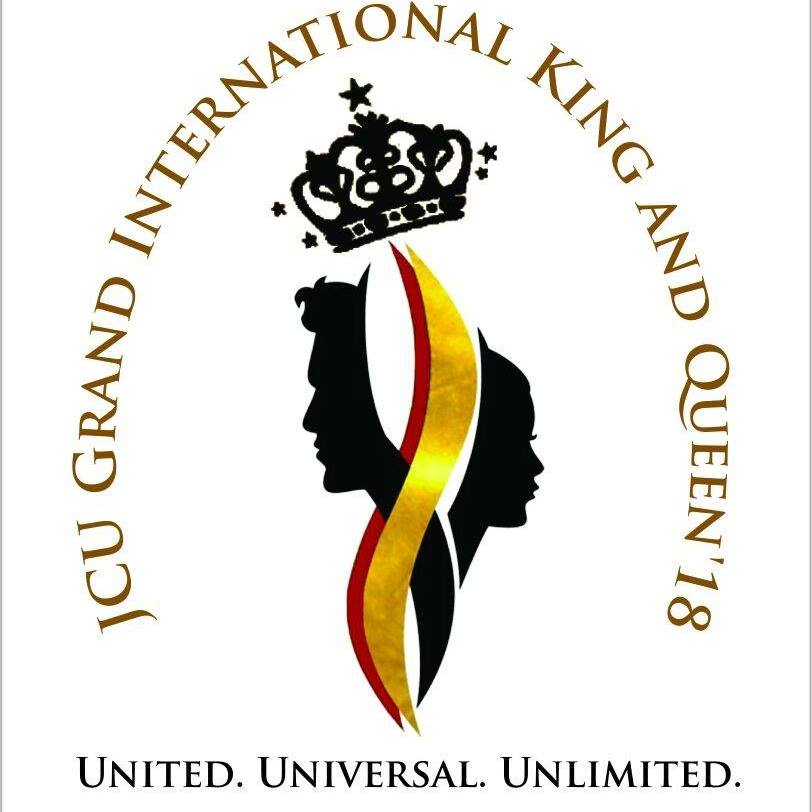
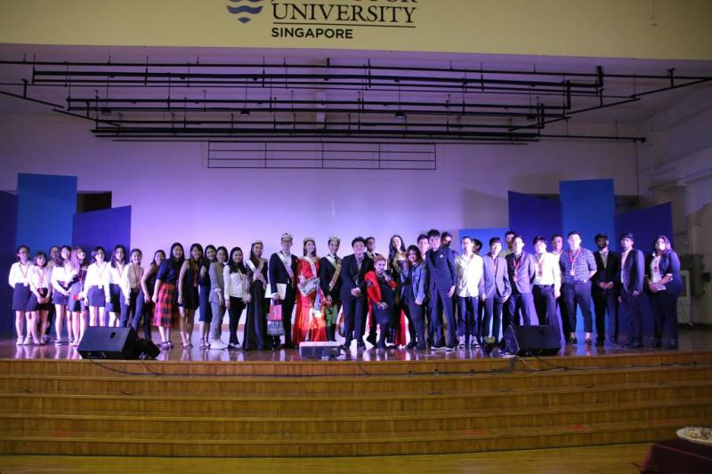

# Conference & Event Management: Grand-International-King-and-Queen-18
Administrate event in updating 10 sub-awards and 2 championships on Facebook and Instagram platforms.

Communicate with 20 team members coming from China, Myanmar, India and New Zealand to manage the event.

Provide Google doc template for seeking potential contestants to participate the event.

Leave creative impression themes event in Grand International King and Queen’18 by attracting 500 attendants following the event.

